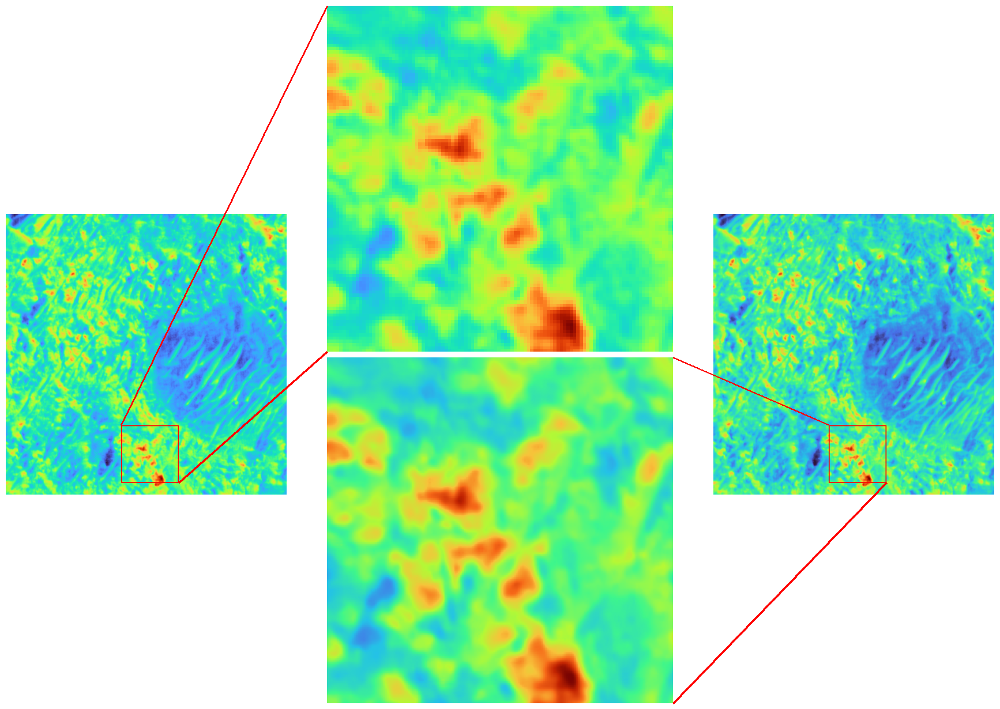

# Generate Zoom Rect Draw from a couple of images
Generate a draw from two squared identical image with zoom in the same position



```
# edit variables into script
python3.8 create_zoom.py
```

# Roadmap
I want to expand this script but only when I will have necessity but the pull request will be well accepted.

* [ ] parametrize the script to use from command line
* [ ] optionally random box
* [ ] optionally one or two image
* [ ] transform in gimp (or other) plugin and chouse the area with a rect selection.
